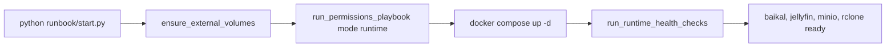
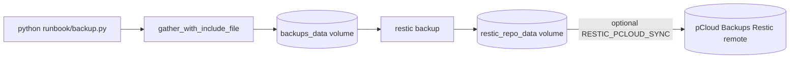
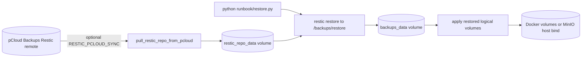
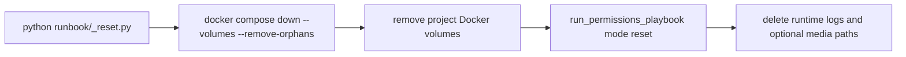

# cloud-apps (SparkNotes)

Small runbook + Docker Compose stack for personal cloud services (Jellyfin, MinIO, Baikal, rclone, restic).

## What you actually run

- Start stack: `python runbook/start.py`
- Stop stack: `python runbook/stop.py`
- Backup snapshot: `python runbook/backup.py`
- Restore snapshot: `python runbook/restore.py [snapshot]`
- Clean-slate reset: `python runbook/_reset.py --yes`

## Setup

1. Create env file:
	- `cp .env.example .env`
2. Set required secrets in `.env`:
	- `MINIO_ROOT_USER`
	- `MINIO_ROOT_PASSWORD`
	- `RESTIC_PASSWORD`
3. Create Python env and install deps:
	- `python -m venv .venv`
	- `source .venv/bin/activate`
	- `pip install .`
4. Ensure Docker + Docker Compose plugin are installed and running.

## Key behavior

- Normal `start` is non-privileged, ensures external volumes exist, uses Ansible in `runtime` mode, then runs Python-owned runtime health checks after `docker compose up -d`.
- Host-level ownership/user creation is `bootstrap` mode (only when needed, may require `sudo`).
- Backups stage selected data into `/backups` before restic snapshots it.
- Reset cleanup uses Ansible `reset` mode before deleting local state.

## Most important config

- `PUID`, `PGID`, `MEDIA_GID` (container/user mapping)
- `RCLONE_REMOTE`

The Docker Compose project name is pinned to `cloud-apps`.

Defaults live in `.env.example`.

### Operational Flow Diagrams

These diagrams separate the startup/runtime pipeline from the one-shot backup, restore, and reset pipelines. That keeps the README aligned with the actual runbook entrypoints and helper boundaries.

#### Startup pipeline

Ansible owns reconciliation and setup; Python owns post-start runtime health checks. At runtime, Jellyfin and Baikal use named volumes, MinIO uses its host bind, and rclone mounts the media path that Jellyfin reads. `python runbook/stop.py` performs the inverse shutdown path: it cleans up the rclone media mount, then runs `docker compose down`.

#### Backup pipeline

The gather stage is intentionally separate from restic. It mounts the logical volumes read-only, filters paths from `configs/backup-include.txt`, and stages the result into `/backups` before restic snapshots it. If the restic repository does not exist yet, `backup.py` initializes it before running the backup step.

#### Restore and reset pipelines

## Repo landmarks

- `runbook/` — human entrypoints (`start`, `stop`, `backup`, `restore`, `_reset`)
- `src/` — implementation code
- `ansible/` + `infra/permissions.yml` — permission orchestration
- `compose/` — compose files
