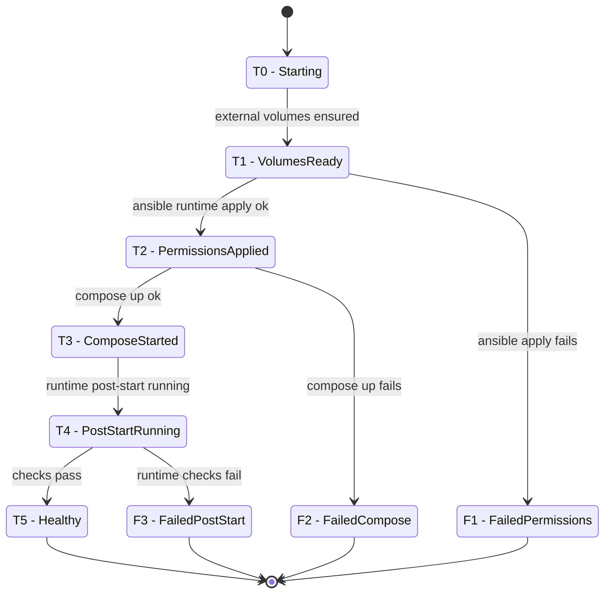

# Project Specification

## 1. Permissions chart

| Storage | Owner (source) | baikal | jellyfin | minio | rclone | restic |
| --- | ---: | :---: | :---: | :---: | :---: | :---: |
| `baikal_config` | baikal:baikal (baikal:8098→5573) | R/W | ✗ | ✗ | ✗ | ✗ |
| `baikal_data` | baikal:baikal (baikal) | R/W | ✗ | ✗ | ✗ | ✗ |
| `jellyfin_config` | jellyfin:jellyfin (jellyfin:8096→5572) | ✗ | R/W | ✗ | ✗ | ✗ |
| `jellyfin_data` | jellyfin:jellyfin (jellyfin) | ✗ | R/W | ✗ | ✗ | ✗ |
| `jellyfin_cache_data` | jellyfin:jellyfin (jellyfin) | ✗ | R/W | ✗ | ✗ | ✗ |
| `restic_repo_data` | — | ✗ | ✗ | ✗ | ✗ | R/W |
| `backups_data` | — | ✗ | ✗ | ✗ | ✗ | R/W |
| `rclone_config` | — | ✗ | ✗ | ✗ | R/— | ✗ |
| `media_source_data` (`/media` in rclone) | Docker volume | ✗ | ✗ | ✗ | R/W | ✗ |
| `media_source_data` (`/media` in jellyfin) | Docker volume (rclone mount source) | ✗ | R/— | ✗ | ✗ | ✗ |
| `LOGS_DIR` (`/logs`) | Host path | R/W | R/W | R/W | R/W | ✗ |
| `MINIO_DATA_DIR` (`/data`) | Host path | ✗ | ✗ | R/W | ✗ | ✗ |

## 1.1 Media Mount

Media is served through the rclone mount directly. Startup does not copy pCloud
media into a second local reader volume.

```bash
./.venv/bin/python runbook/start.py
```

The `media-sync` startup step is a compatibility no-op in mount-only mode.

## 1.2 Runtime Prerequisite

`runbook/start.py` and `runbook/reconcile.py` runtime flow require Docker daemon
access from the current shell user. Ensure `docker info` succeeds before running
the runbooks.

## 2. Startup process



Rows are traversal states (`T0` to `T5`) plus failure exits (`F1` to `F3`).

| State | Ensure volumes | Apply permissions | Compose up | Post-start | Health checks | Transition |
| --- | :---: | :---: | :---: | :---: | :---: | --- |
| `T0` | ✗ | — | — | — | — | startup begins |
| `T1` | ✓ | — | — | — | — | volumes ok |
| `T2` | ✓ | ✓ | — | — | — | permissions ok |
| `T3` | ✓ | ✓ | ✓ | — | — | compose up ok |
| `T4` | ✓ | ✓ | ✓ | ✓ | — | post-start ok |
| `T5` | ✓ | ✓ | ✓ | ✓ | ✓ | health checks ok |
| `F1` | ✓ | ✗ | — | — | — | permissions failed from `T1` |
| `F2` | ✓ | ✓ | ✗ | — | — | compose failed from `T2` |
| `F3` | ✓ | ✓ | ✓ | ✓ | ✗ | runtime verification failed from `T4` |

> State names are defined in section 1 labels (for example, `T0 - Starting`, `F1 - FailedPermissions`).
