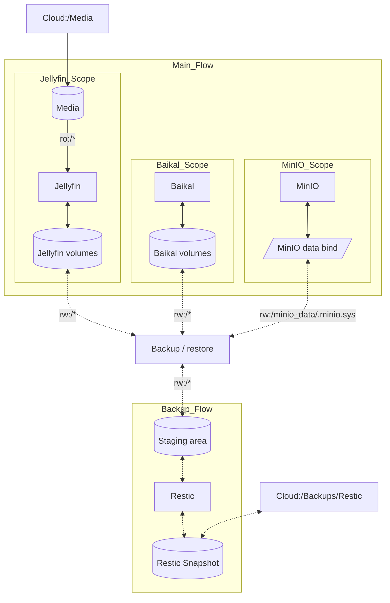

# cloud-apps (SparkNotes)

Small runbook + Docker Compose stack for personal cloud services (Jellyfin, MinIO, Baikal, rclone, restic).

## What you actually run

- Start stack: `python runbook/start.py`
- Stop stack: `python runbook/stop.py`
- Backup snapshot: `python runbook/backup.py`
- Restore snapshot: `python runbook/restore.py [snapshot] [target]`
- Clean-slate reset: `python runbook/_reset.py --yes`

## Setup

1. Create env file:
	- `cp .env.example .env`
2. Set required secrets in `.env`:
	- `MINIO_ROOT_USER`
	- `MINIO_ROOT_PASSWORD`
	- `RESTIC_PASSWORD`
3. Create Python env and install deps:
	- `python -m venv .venv`
	- `source .venv/bin/activate`
	- `pip install -r requirements.txt ansible`
4. Ensure Docker + Docker Compose plugin are installed and running.

## Key behavior

- Normal `start` is non-privileged and uses Ansible in `runtime` mode.
- Host-level ownership/user creation is `bootstrap` mode (only when needed, may require `sudo`).
- Reset cleanup uses Ansible `reset` mode before deleting local state.

## Most important config

- `PROJECT_NAME` (compose project/volume prefix)
- `PUID`, `PGID`, `MEDIA_GID` (container/user mapping)
- `MEDIA_PROPAGATION` (default `rprivate`)
- `RCLONE_REMOTE`

Defaults live in `.env.example`.

### Permission Flow Diagram

## Repo landmarks

- `runbook/` — human entrypoints (`start`, `stop`, `backup`, `restore`)
- `src/` — implementation code
- `ansible/` + `infra/permissions.yml` — permission orchestration
- `compose/` — compose files
