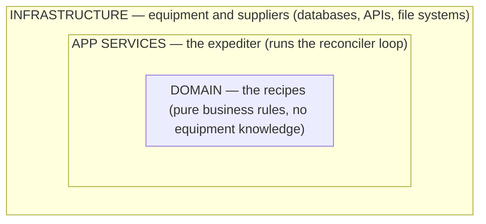
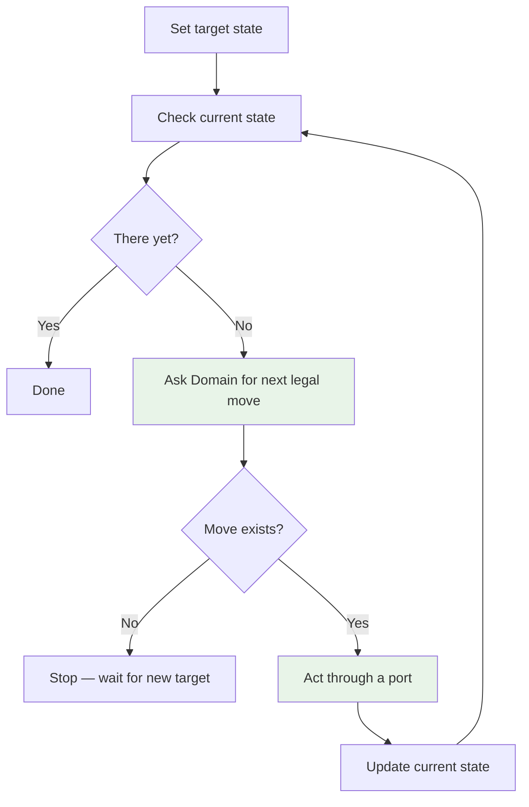
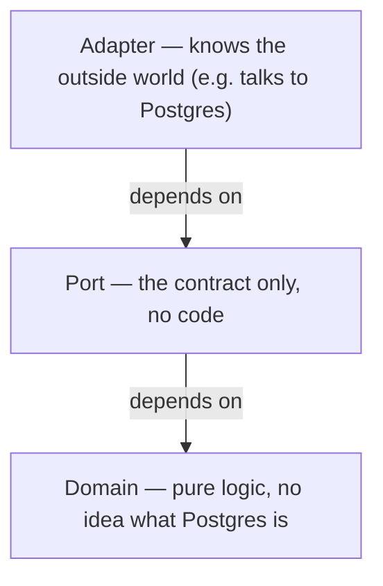

# Design Reference

Answer Steps 1–4 before writing code. Breaking any rule means the design is wrong.

## Rules

| # | Rule | Broken when… |
| --- | --- | --- |
| 1 | Data flows one way between parts. | A return path exists. |
| 2 | Each responsibility has one owner. | Two tools can change the same thing. |
| 3 | Every rule is automatically enforced. | Code review is the only check. |
| 4 | Code only depends on things closer to the core. | A business logic file imports a database driver. |

## Structure

Think of it like a kitchen: the head chef writes recipes without knowing what equipment exists. The expediter calls out orders. Equipment just does what it's told.



> 🔌 **Ports and adapters:** like USB-C — your laptop declares the port shape; it doesn't care if a charger or monitor is plugged in. Inner layers declare port shapes. Outer layers plug in. Inner layers never reach outward directly (Rule 4).

## Step 1 — Who Owns What?

| Responsibility | Layer | Owner |
| --- | --- | --- |
| **Domain Model** — rules, state machine, transitions. Its own named module always. | Domain | |
| **Orchestration** — runs the reconciler; sole sequencing authority. | App Services | |
| **State & Secrets** — desired state; secrets encrypted, never plaintext. | Infrastructure | |
| **Service Topology** — what services run and how they connect. | Infrastructure | |
| **Config** — flags, timeouts, URLs. | Infrastructure | |

Two owners sharing a responsibility → note it. Blank owner → fix it.

## Step 2 — How Do They Talk?

| | Orchestration |
| --- | --- |
| **Domain Model** | `StateMachine` — `observe() → S`, `next(current: S, desired: S) → Move \| None` |
| **State & Secrets** | `StateStore`, `SecretReader` |
| **Service Topology** | `TopologyApplier` |
| **Config** | `ConfigReader` |

Each cell needs: `Port` / `Command` / `Status` / `Adapter` / `Authority: Orchestration`.

### State Vectors

> 💡 **Smart home lights:** your house has three lights. Current state: `⟨on, off, on⟩`. "Movie mode" is just a shortcut for a target state: `⟨off, off, on⟩`. The system diffs and flips the right switches. `ERR` is just another value — no special handling needed.

| State | [A] | [B] | [N] | Command |
| --- | :---: | :---: | :---: | --- |
| `T0` | `·` | `·` | `·` | `reset` |
| `T1` | `OK` | `·` | `·` | |
| `Tn` | `OK` | `OK` | `OK` | `run` |
| `F1` | `OK` | `ERR` | `·` | |

### Reconciler

> 🌡️ Like a thermostat — set a target, check current, act, repeat. No special broken-furnace mode; it just runs out of valid moves and waits.



## Step 3 — Write Two Docs

**`ARCHITECTURE.md`** — Steps 1–2 outputs + a **Forbidden Dependencies** list (every Rule 4 violation, named).

**`CONTRIBUTING.md`** — setup + one rule per boundary (each automatically enforced) + Port Compliance (linter/type rule per port) + PR checklist as an automation to-do list, not a permanent process.

## Step 4 — Design the Pieces

> 🧱 One brick, one shape. Need "and" to describe it? Split it.

Three tiers per responsibility — each a separate file, linter-enforced:



**Component card:**

```text
Name:            Tier: domain / port / adapter
Responsibility:  one sentence
Inputs/Outputs:  Side effects:   Idempotent?
Port satisfied:  (adapter only)
```

**A component must:** have one job · declare all inputs upfront · pass data forward only · same input = same output · fail loudly · never import across tiers.

**Final check:** all dependency arrows point inward or sideways. Any arrow pointing outward → redesign before writing code.
