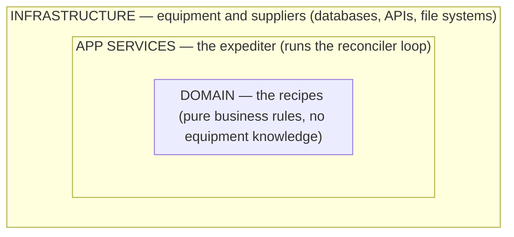
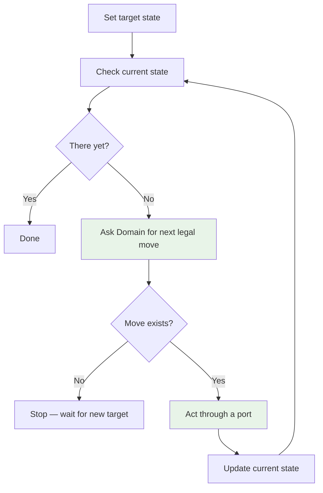
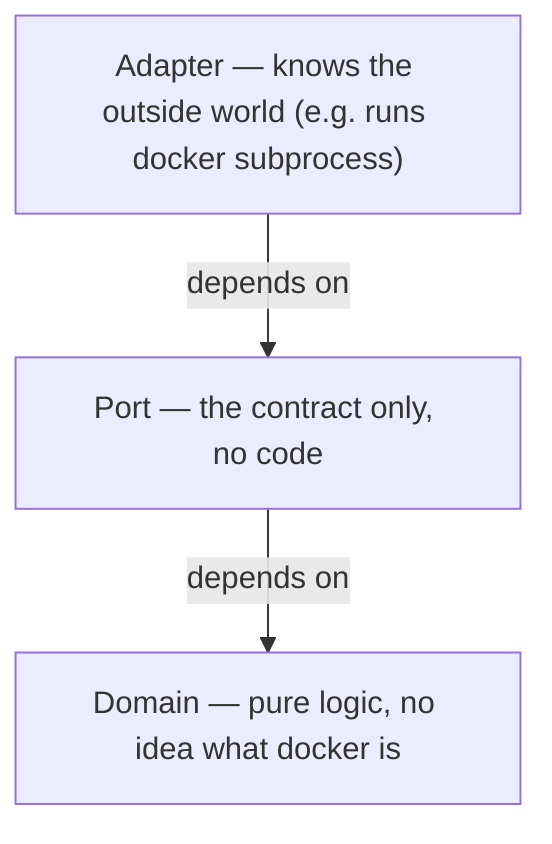

# Design Reference

Answer Steps 1–4 before writing code. Breaking any rule means the design is wrong.

## Rules

| # | Rule | Broken when… |
| --- | --- | --- |
| 1 | Data flows one way between parts. | A return path exists. |
| 2 | Each responsibility has one owner. | Two tools can change the same thing. |
| 3 | Every rule is automatically enforced. | Code review is the only check. |
| 4 | Code only depends on things closer to the core. | A business logic file imports a database driver. |

## Structure

Think of it like a kitchen: the head chef writes recipes without knowing what equipment exists. The expediter calls out orders. Equipment just does what it's told.



> 🔌 **Ports and adapters:** like USB-C — your laptop declares the port shape; it doesn't care if a charger or monitor is plugged in. Inner layers declare port shapes. Outer layers plug in. Inner layers never reach outward directly (Rule 4).

## Module Map

### Ports (`src/ports/`)

| Port | File | Implemented by |
| --- | --- | --- |
| `BackupStage` | `backup_stage.py` | `RcloneStreamSync` |
| `SecretProviderPort` | `secrets.py` | `EnvironmentSecretProvider`, `AnsibleVaultSecretProvider` |
| `ResticRunnerPort` | `restic_runner.py` | `DockerResticAdapter` *(stub)* |
| `PermissionsRunnerPort` | `permissions_runner.py` | `AnsiblePermissionsAdapter` *(stub)* |
| `HealthProberPort` | `health_prober.py` | `DockerHealthAdapter` *(stub)* |

### Adapters (`src/adapters/`)

| Adapter | Port satisfied |
| --- | --- |
| `rclone/stream_sync.py` — `RcloneStreamSync` | `BackupStage` |
| `secrets/env_provider.py` — `EnvironmentSecretProvider` | `SecretProviderPort` |
| `secrets/vault_provider.py` — `AnsibleVaultSecretProvider` | `SecretProviderPort` |
| `restic/docker_restic.py` — `DockerResticAdapter` | `ResticRunnerPort` *(stub)* |
| `permissions/ansible_adapter.py` — `AnsiblePermissionsAdapter` | `PermissionsRunnerPort` *(stub)* |
| `health/docker_health.py` — `DockerHealthAdapter` | `HealthProberPort` *(stub)* |

### Infrastructure (`src/infra/`)

Platform utilities used by adapters. Not imported by orchestrators or workflows directly.

- `runtime.py` — path resolution (`repo_root`, `state_root`, etc.)
- `locking.py` — filesystem-based process locks
- `polling.py` — generic `wait_until` with configurable probes
- `config.py` — rclone/restic config getters (reads via `SecretProviderPort`)
- `secrets.py` — `read_secret()` wired to `SecretProviderPort`; auto-detects Vault or env backend
- `io/` — atomic JSON state read/write, condition helpers
- `docker/` — compose CLI arg building, YAML parsing, volume resolution, rclone subprocess wrapper

### Reconciler (`src/reconciler/`)

- `core.py` — orchestration entry point for one reconciliation pass
- `state_machine.py` — legal transition rules (IDLE → PROBED → APPLYING → VERIFIED)
- `runtime_observer.py` — read-only probes for volumes, services, and media
- `state_store.py` — persisted reconcile state load/save
- `pipeline_actions.py` — executes pipeline stages and marks conditions

## Layer Contracts (import-linter)

```toml
[[tool.importlinter.contracts]]
name = "Domain must not import Infrastructure"
source_modules = ["src.configuration"]
forbidden_modules = ["src.toolbox"]   # → "src.infra" once migration is complete

[[tool.importlinter.contracts]]
name = "App Services must not import Infrastructure concrete modules"
source_modules = ["src.workflows", "src.orchestrators"]
forbidden_modules = ["src.infra"]
```

Run: `PYTHONPATH=. .venv/bin/lint-imports`

> ⚠️ **Migration in progress** — `src/toolbox/` is being renamed to `src/infra/`. See `NEXT_STEPS.md`. The first contract above will update its `forbidden_modules` to `src.infra` once the move is complete.

## Step 1 — Who Owns What?

| Responsibility | Layer | Owner |
| --- | --- | --- |
| **Domain Model** — rules, state machine, transitions | Domain | `src/reconciler/state_machine.py` |
| **Orchestration** — sequences workflows | App Services | `src/orchestrators/` |
| **State & Secrets** — desired state; secrets encrypted, never plaintext | Infrastructure | `src/infra/secrets.py` + vault |
| **Service Topology** — what services run and how they connect | Infrastructure | `compose/`, `src/storage/` |
| **Config** — flags, timeouts, URLs | Infrastructure | `src/infra/config.py`, `configs/` |

## Step 2 — How Do They Talk?

| | Orchestration |
| --- | --- |
| **Domain Model** | `StateMachine` — `observe() → S`, `next(current: S, desired: S) → Move \| None` |
| **State & Secrets** | `StateStore`, `SecretProviderPort` |
| **Service Topology** | `TopologyApplier` |
| **Config** | `ConfigReader` |

### Reconciler



## Step 4 — Design the Pieces

Three tiers per responsibility — each a separate file, linter-enforced:



**A component must:** have one job · declare all inputs upfront · pass data forward only · same input = same output · fail loudly · never import across tiers.

**Final check:** all dependency arrows point inward or sideways. Any arrow pointing outward → redesign before writing code.
