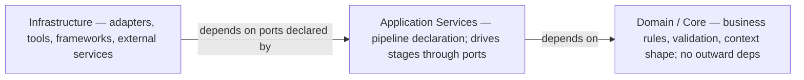
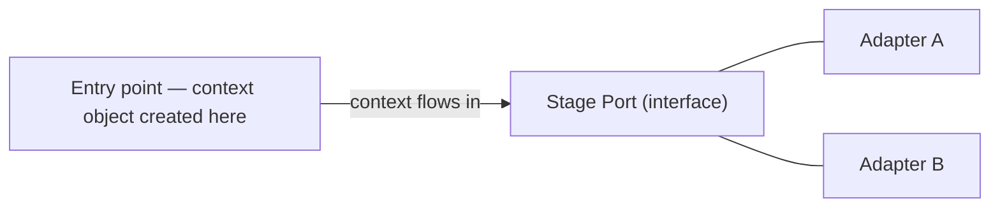
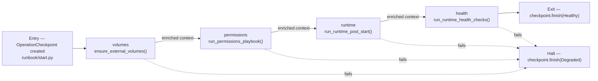
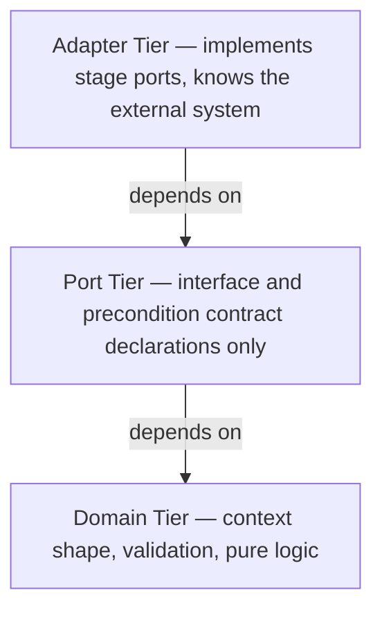

# Architecture Reference

Complete Steps 1–3 before writing code. Breaking any rule means the design is wrong.

---

## Foundational Constraints

Non-negotiable. If a design decision conflicts with any of these, the decision is wrong.

**1. Data flows in one direction.** A context object enters the pipeline at the entry point and moves forward — never backward. A return path means the boundary is wrong.

**2. Every concern has exactly one owner.** Shared ownership is a hidden bidirectional flow. If two components write to the same concern, one is out of scope.

**3. Every rule has an enforcement mechanism.** A rule without one is a suggestion. Review-only rules are temporary — treat them as candidates for automation.

**4. Dependencies point inward — toward the domain.** Outer layers may depend on inner layers; inner layers never depend on outer ones.

**5. Every component is replaceable.** A component that cannot be swapped for another with the same port signature is too unique. Uniqueness is a design smell.

---

## Architecture Model

### Layers



### Ports and Adapters

A **port** is an interface declared by an inner layer describing *what it needs*, not *how it is provided*. An **adapter** is its outer-layer implementation.



Inner layers declare port shapes. Outer layers implement them. A stage can be swapped for any adapter that satisfies its port — the pipeline does not change.

### The Context Object

The **context object** is what flows through the pipeline — a single typed structure that carries everything a stage might need and accumulates outputs as it moves forward.

- Declared and owned by the Domain layer.
- Immutable between stages — each stage receives the current context and returns a new one.
- Shape is fixed at the entry point. Stages may enrich it; they may not remove or rename fields.

---

## Step 1 — Who Owns What?

| Concern | Layer | Owner |
| --- | --- | --- |
| **Domain Model** — context shape, preconditions, validation rules | Core | `src/configuration/` — `WorkflowState`, `BackupConfig`, `StorageManifest` |
| **Pipeline Declaration** — ordered stage list; owns sequencing | Application Services | `src/workflows/pipeline.py` — `PIPELINE_STEPS` |
| **Stage Adapters** — one concrete implementation per external system | Infrastructure | `src/adapters/` — rclone, secrets |
| **State & Secrets** — credentials and env values fed into context at creation | Infrastructure | `src/infra/secrets.py` + vault / env |
| **Config** — flags, timeouts, feature switches | Infrastructure | `src/infra/config.py`, `configs/` |

Shared owner → note it. Blank owner → fix it.

---

## Step 2 — Declare the Pipeline

> **Resolve first — error strategy.** This project uses `halt`. A stage failure stops the pipeline and marks the checkpoint as failed. Do not change this without updating all stage preconditions.

### Stage Contracts

Each stage is defined by a port contract. The pipeline declaration is a static ordered list — there is no runtime sequencing logic. Preconditions assert the **shape of incoming data** only — not what stage ran before.

```text
Entry point:    runbook/start.py → src/orchestrators/start.py creates OperationCheckpoint
Error strategy: halt

Stages (in order):
  1. volumes
     Port:           VolumeEnsurer (implicit — src/storage/compose.py)
     Adapter:        ensure_external_volumes()
     Reads:          compose config (rendered_compose_config)
     Writes:         external volumes confirmed present
     Preconditions:  Docker daemon accessible

  2. permissions
     Port:           PermissionsRunner (implicit — src/permissions/ansible.py)
     Adapter:        run_permissions_playbook(mode="runtime")
     Reads:          ansible/permissions.yml, ansible/inventory.ini
     Writes:         host volume ownership and modes applied
     Preconditions:  ansible-playbook binary available

  3. runtime
     Port:           PostStartRunner (implicit — src/observability/post_start.py)
     Adapter:        run_runtime_post_start()
     Reads:          running compose stack
     Writes:         post-start tasks applied (e.g. jellyfin restart)
     Preconditions:  compose stack running

  4. health
     Port:           HealthProber (implicit — src/observability/health.py)
     Adapter:        run_runtime_health_checks()
     Reads:          running containers
     Writes:         health status confirmed
     Preconditions:  containers started

Exit point:     checkpoint.finish(observed="Healthy") — OperationCheckpoint written to disk
```

### Data Flow



### Contract Matrix

| | Pipeline Declaration (`src/workflows/pipeline.py`) |
| --- | --- |
| **Domain Model** | `WorkflowState` — `src/configuration/state_model.py` |
| **Stage 1 — volumes** | Port: `VolumeEnsurer` → `src/storage/compose.py` |
| **Stage 2 — permissions** | Port: `PermissionsRunner` → `src/permissions/ansible.py` |
| **Stage 3 — runtime** | Port: `PostStartRunner` → `src/observability/post_start.py` |
| **Stage 4 — health** | Port: `HealthProber` → `src/observability/health.py` |
| **State & Secrets** | `src/infra/secrets.py` — `SecretProviderPort` |
| **Config** | `src/infra/config.py` — `ConfigReader` |

---

## Step 3 — Design Components

One component, one job. If describing it requires "and", split it.

### Internal Layer Model

Each concern organizes its components into three tiers. Inner tiers never depend on outer tiers. Each tier is a physically separate file, enforced by the linter.



### Rules

**One job.** One reason to change. Two independent forces → split it.

**Declared interface.** Inputs, outputs, and preconditions declared at the port tier. Nothing implicit.

**No hidden dependencies.** Everything a component needs arrives in the context object. Nothing fetched globally or injected mid-execution.

**Forward-only flow.** A component receives context, enriches it, returns it. No callbacks into the pipeline; no modifications to previous stages' outputs.

**Idempotent where stateful.** Same context in, same context out. Non-idempotent components are explicitly named as such and trigger a review of the error strategy.

**Fail explicitly.** Cannot satisfy its responsibility → return a typed error immediately. The pipeline's declared error strategy takes over.

**No cross-tier imports.** A domain-tier component never imports an adapter. Violation is a violation of Constraint 4.

**Cookie-cutter first.** Before building a unique component, check whether an existing component with a different adapter satisfies the need. Uniqueness requires justification.

### Module Map

#### Ports (`src/ports/`)

| Port | File | Implemented by |
| --- | --- | --- |
| `BackupStage` | `backup_stage.py` | `RcloneStreamSync` |
| `SecretProviderPort` | `secrets.py` | `EnvironmentSecretProvider`, `AnsibleVaultSecretProvider` |

#### Adapters (`src/adapters/`)

| Adapter | Port satisfied |
| --- | --- |
| `rclone/stream_sync.py` — `RcloneStreamSync` | `BackupStage` |
| `secrets/env_provider.py` — `EnvironmentSecretProvider` | `SecretProviderPort` |
| `secrets/vault_provider.py` — `AnsibleVaultSecretProvider` | `SecretProviderPort` |

#### Infrastructure (`src/infra/`)

Platform utilities used by adapters and orchestrators. Not imported by domain or workflow layers directly.

- `config.py` — rclone/restic config getters
- `locking.py` — filesystem-based process locks
- `secrets.py` — `read_secret()` wired to `SecretProviderPort`; auto-detects Vault or env backend
- `docker/compose_cli.py` — compose CLI arg building
- `docker/compose_storage.py` — YAML parsing, external volume discovery
- `docker/rclone.py` — rclone subprocess wrapper
- `docker/volumes_config.py` — volume path resolution
- `docker/volumes_inspector.py` — volume inspection
- `io/` — atomic JSON state read/write, condition helpers

### Dependency Audit

1. All dependencies point inward (adapter → port → domain) or stay lateral within the same tier.
2. Every component passes the cookie-cutter check: accepts context, returns enriched context, no hidden deps, swappable.

Any violation means the boundary is wrong. Redraw before writing code.

---

## Layer Contracts (import-linter)

```toml
[[tool.importlinter.contracts]]
name = "Domain must not import Infrastructure"
source_modules = ["src.configuration"]
forbidden_modules = ["src.infra"]

[[tool.importlinter.contracts]]
name = "App Services must not import Infrastructure concrete modules"
source_modules = ["src.workflows", "src.orchestrators"]
forbidden_modules = ["src.infra"]
```

Run: `PYTHONPATH=. .venv/bin/lint-imports`
