# Flow Tree

- **Entry:** [runbook/start.py](../runbook/start.py) — `__main__` delegates to [src/orchestrators/start.py](../src/orchestrators/start.py) `main()`

- **Main:** [src/orchestrators/start.py](../src/orchestrators/start.py) — `main()`
  - **Preflight:** `ensure_docker_daemon_access()` from [src/observability/health.py](../src/observability/health.py)
  - **Config:** `runbook_resume_enabled()` from [src/infra/config.py](../src/infra/config.py)
  - **Lock:** `RunbookLock` context manager from [src/infra/locking.py](../src/infra/locking.py)
  - **Checkpoint:** `OperationCheckpoint` from [src/workflows/checkpoint.py](../src/workflows/checkpoint.py) — uses `start()`, `should_skip_stage()`, `mark_stage()`, `finish()`
  - **Runner:** `start_checkpoint()` / `run_checkpoint_stages()` from [src/workflows/workflow_runner.py](../src/workflows/workflow_runner.py)

  - **Stage: volumes**
    - `ensure_external_volumes()` from [src/storage/compose.py](../src/storage/compose.py)
      - `missing_external_volumes()` → `required_external_volume_names()` from [src/storage/volumes.py](../src/storage/volumes.py)
      - `probe_external_volume()` — `docker volume inspect` via subprocess
      - `rendered_compose_config()` from [src/infra/docker/compose_storage.py](../src/infra/docker/compose_storage.py) — discovers configured external volumes

  - **Stage: permissions**
    - `run_permissions_playbook()` from [src/permissions/ansible.py](../src/permissions/ansible.py)
      - `ansible_playbook_bin()` — resolves virtualenv-aware `ansible-playbook` binary
      - executes `ansible-playbook` via `subprocess.run`

  - **Stage: runtime (post-start)**
    - `run_runtime_post_start()` from [src/observability/post_start.py](../src/observability/post_start.py)
      - `restart_jellyfin()` → `docker restart jellyfin` (subprocess)

  - **Stage: health**
    - `run_runtime_health_checks()` from [src/observability/health.py](../src/observability/health.py)
      - series of `probe_container_health()` checks using `docker exec` probes
      - `wait_until()` from [src/infra/polling.py](../src/infra/polling.py) — polling loop with configurable timeout

- **Finalization:** `checkpoint.finish()` marks observed status and completes the workflow

**Notes:**

- This tree focuses on the call graph executed by `main()` in the start runbook. Many leaf functions execute subprocess commands (`docker`, `ansible-playbook`) or read configuration/secrets from `src/infra/config.py` and `src/infra/secrets.py`.
- The pipeline stage list is defined in [src/workflows/pipeline.py](../src/workflows/pipeline.py) as `PIPELINE_STEPS`.

## Diagram

```mermaid
flowchart TD
  entry["runbook/start.py\n(__main__)"]
  orchestrator["src/orchestrators/start.py\nmain()"]
  entry --> orchestrator

  preflight["ensure_docker_daemon_access()"]
  config["runbook_resume_enabled()"]
  lock["RunbookLock"]
  checkpoint["OperationCheckpoint\n(start/should_skip/mark_stage/finish)"]
  orchestrator --> preflight
  orchestrator --> config
  orchestrator --> lock
  orchestrator --> checkpoint

  subgraph volumes_stage["Stage: volumes"]
    ensure["ensure_external_volumes()\nsrc/storage/compose.py"]
    missing["missing_external_volumes()"]
    required["required_external_volume_names()\nsrc/storage/volumes.py"]
    probe["probe_external_volume()\n(docker volume inspect)"]
    compose_storage["rendered_compose_config()\nsrc/infra/docker/compose_storage.py"]
    ensure --> missing --> required
    ensure --> probe
    ensure --> compose_storage
  end
  orchestrator --> volumes_stage

  subgraph permissions_stage["Stage: permissions"]
    ansible["run_permissions_playbook()\nsrc/permissions/ansible.py"]
    bin["ansible_playbook_bin()"]
    ansible --> bin
  end
  orchestrator --> permissions_stage

  subgraph runtime_stage["Stage: runtime (post-start)"]
    post["run_runtime_post_start()\nsrc/observability/post_start.py"]
    restart["restart_jellyfin()\n(docker restart jellyfin)"]
    post --> restart
  end
  orchestrator --> runtime_stage

  subgraph health_stage["Stage: health"]
    health["run_runtime_health_checks()\nsrc/observability/health.py"]
    probe_c["probe_container_health()\n(docker exec probes)"]
    polling["wait_until()\nsrc/infra/polling.py"]
    health --> probe_c --> polling
  end
  orchestrator --> health_stage

  checkpoint --> finish["checkpoint.finish()"]
```

