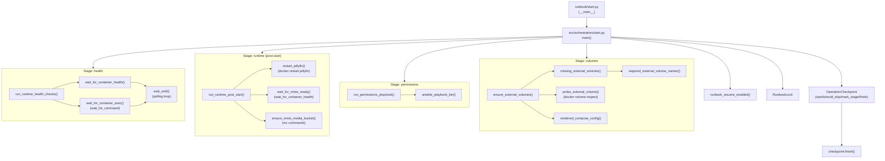

# Flow Tree

- **Entry:** [runbook/start.py](runbook/start.py#L6) — `__main__` delegates to [src/orchestrators/start.py](src/orchestrators/start.py#L18) `main()`

- **Main:** [src/orchestrators/start.py](src/orchestrators/start.py#L18) — `main()`
  - **Config:** `runbook_resume_enabled()` from [src/toolbox/core/config.py](src/toolbox/core/config.py#L48)
  - **Lock:** `RunbookLock` context manager from [src/toolbox/core/locking.py](src/toolbox/core/locking.py#L9)
  - **Checkpoint:** `OperationCheckpoint` from [src/managers/checkpoint.py](src/managers/checkpoint.py#L16) — uses `start()`, `should_skip_stage()`, `mark_stage()`, `finish()`

  - **Stage: volumes**
    - `ensure_external_volumes()` from [src/toolbox/docker/compose.py](src/toolbox/docker/compose.py#L43)
      - calls `missing_external_volumes()` → `required_external_volume_names()` from [src/toolbox/docker/volumes.py](src/toolbox/docker/volumes.py#L46)
      - probes volumes via `probe_external_volume()` (calls `docker volume inspect` via subprocess)
      - `rendered_compose_config()` (in [src/toolbox/docker/compose_storage.py](src/toolbox/docker/compose_storage.py#L1)) used to discover configured external volumes

  - **Stage: permissions**
    - `run_permissions_playbook()` from [src/toolbox/core/ansible/ansible_runner.py](src/toolbox/core/ansible/ansible_runner.py#L15)
      - builds `ansible-playbook` command using `ansible_playbook_bin()` ([src/toolbox/core/ansible/ansible_playbook.py](src/toolbox/core/ansible/ansible_playbook.py#L1))
      - executes via `subprocess.run`

  - **Stage: runtime (post-start)**
    - `run_runtime_post_start()` from [src/toolbox/docker/post_start/**init**.py](src/toolbox/docker/post_start/__init__.py#L11)
      - `restart_jellyfin()` ([src/toolbox/docker/post_start/jellyfin.py](src/toolbox/docker/post_start/jellyfin.py#L6)) → `docker restart jellyfin` (subprocess)
      - `wait_for_minio_ready()` ([src/toolbox/docker/post_start/minio.py](src/toolbox/docker/post_start/minio.py#L1)) → uses `wait_for_container_health()` ([src/toolbox/docker/health.py](src/toolbox/docker/health.py#L147))
      - `minio_credentials()` from [src/toolbox/core/config.py](src/toolbox/core/config.py#L8) → `ensure_minio_media_bucket()` ([src/toolbox/docker/post_start/minio.py](src/toolbox/docker/post_start/minio.py#L64)) (subprocess `mc` commands)

  - **Stage: health**
    - `run_runtime_health_checks()` from [src/toolbox/docker/health.py](src/toolbox/docker/health.py#L147)
      - runs a series of `wait_for_container_exec()` checks (calls `wait_for_command()`)
      - calls `wait_for_container_health()` which wraps `wait_for_command()` with a `success_predicate`
      - `wait_for_command()` uses `wait_until()` ([src/toolbox/core/polling.py](src/toolbox/core/polling.py#L15)) to poll subprocess probes until ready or timeout

- **Finalization:** `checkpoint.finish()` is called to mark observed status and complete the workflow

**Notes:**

- This tree focuses on the call graph executed by `main()` in the start runbook. Many leaf functions execute subprocess commands (docker, mc, ansible) or read configuration/secrets (`src/toolbox/core/config.py`, `src/toolbox/core/secrets.py`).

## Diagram

