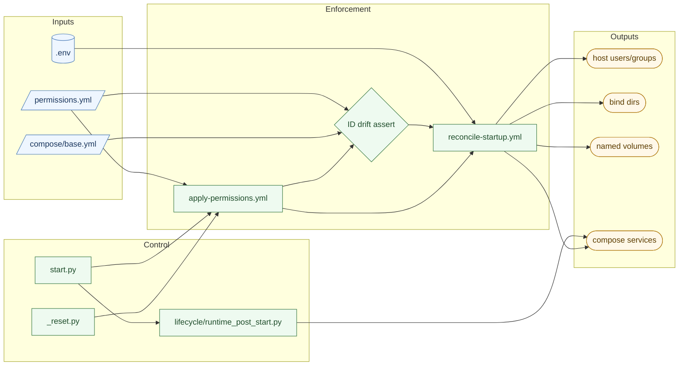
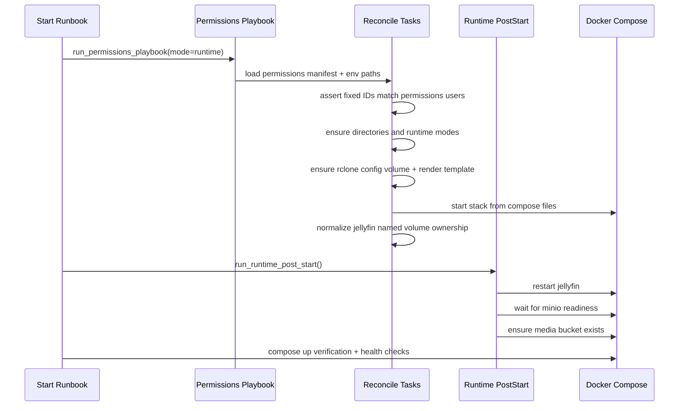

# Permissions Structure

This project centralizes permissions in declarative config and enforces them through Ansible before and during runtime.

## Architecture

## Runtime Sequence

## Key Rules

- IDs are centralized and fixed in Compose + permissions manifest, not user-facing env knobs.
- `.env` should carry path/secrets/runtime values, not ownership policy.
- Any ID drift between Compose and permissions manifest fails early in Ansible.
- Post-start runtime actions are toolbox-split under `src/utils/docker/post_start/` (Jellyfin + MinIO) and orchestrated by `src/utils/docker/lifecycle/runtime_post_start.py`.
