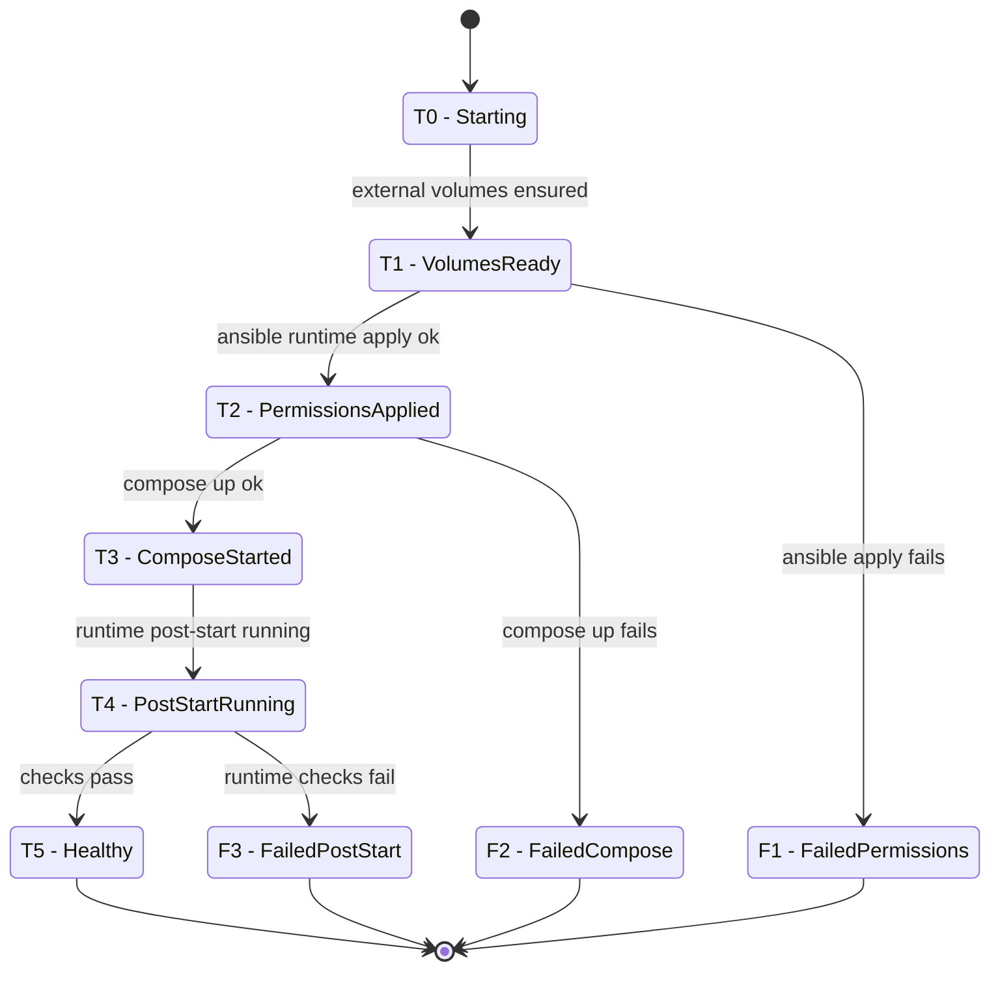

# Project Manifest

## 1. Permissions chart

| Storage | Owner (source) | baikal | jellyfin | minio | rclone | restic |
| --- | ---: | :---: | :---: | :---: | :---: | :---: |
| `baikal_config` | baikal:baikal (8098:5573) | 🟩 R/W | 🟥 - | 🟥 - | 🟥 - | 🟥 - |
| `baikal_data` | baikal:baikal (8098:5573) | 🟩 R/W | 🟥 - | 🟥 - | 🟥 - | 🟥 - |
| `jellyfin_config` | jellyfin:jellyfin (8096:5572) | 🟥 - | 🟩 R/W | 🟥 - | 🟥 - | 🟥 - |
| `jellyfin_data` | jellyfin:jellyfin (8096:5572) | 🟥 - | 🟩 R/W | 🟥 - | 🟥 - | 🟥 - |
| `jellyfin_cache_data` | jellyfin:jellyfin (8096:5572) | 🟥 - | 🟩 R/W | 🟥 - | 🟥 - | 🟥 - |
| `restic_repo_data` |  | 🟥 - | 🟥 - | 🟥 - | 🟥 - | 🟩 R/W |
| `backups_data` |  | 🟥 - | 🟥 - | 🟥 - | 🟥 - | 🟩 R/W |
| `rclone_config` |  | 🟥 - | 🟥 - | 🟥 - | 🟦 R | 🟥 - |
| `MEDIA_DATA_PATH` (`/media`) | Host path | 🟥 - | 🟦 R | 🟥 - | 🟩 R/W | 🟥 - |
| `LOGS_DIR` (`/logs`) | Host path | 🟩 R/W | 🟩 R/W | 🟩 R/W | 🟩 R/W | 🟥 - |
| `MINIO_DATA_DIR` (`/data`) | Host path | 🟥 - | 🟥 - | 🟩 R/W | 🟥 - | 🟥 - |

## 2. Startup process

Rows are traversal states (`T0` to `T5`) plus failure exits (`F1` to `F3`).

| State | Ensure volumes | Apply permissions | Compose up | Post-start | Health checks | Transition |
| --- | :---: | :---: | :---: | :---: | :---: | --- |
| `T0` | 🟥 | 🟥 | 🟥 | 🟥 | 🟥 | startup begins |
| `T1` | ✅ | 🟥 | 🟥 | 🟥 | 🟥 | volumes ok |
| `T2` | ✅ | ✅ | 🟥 | 🟥 | 🟥 | permissions ok |
| `T3` | ✅ | ✅ | ✅ | 🟥 | 🟥 | compose up ok |
| `T4` | ✅ | ✅ | ✅ | ✅ | 🟥 | post-start ok |
| `T5` | ✅ | ✅ | ✅ | ✅ | ✅ | health checks ok |
| `F1` | ✅ | 🟥 | 🟥 | 🟥 | 🟥 | permissions failed from `T1` |
| `F2` | ✅ | ✅ | 🟥 | 🟥 | 🟥 | compose failed from `T2` |
| `F3` | ✅ | ✅ | ✅ | ✅ | 🟥 | runtime verification failed from `T4` |

>State names are defined in section 1 labels (for example, `T0 - Starting`, `F1 - FailedPermissions`).
