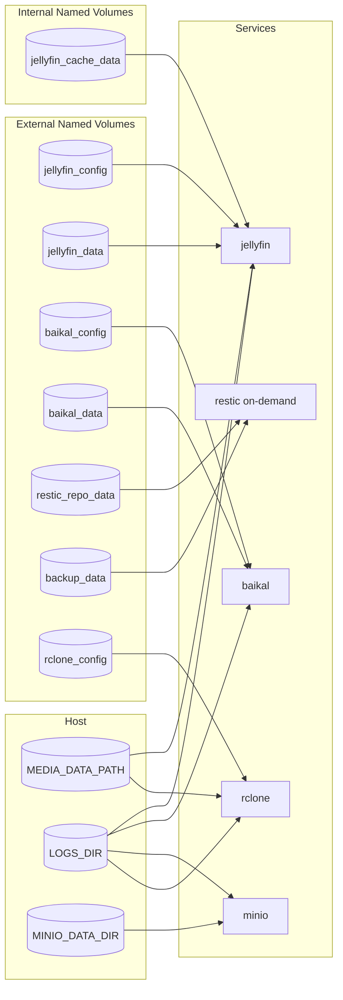
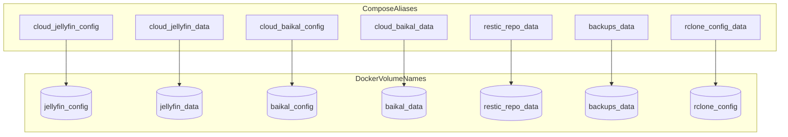
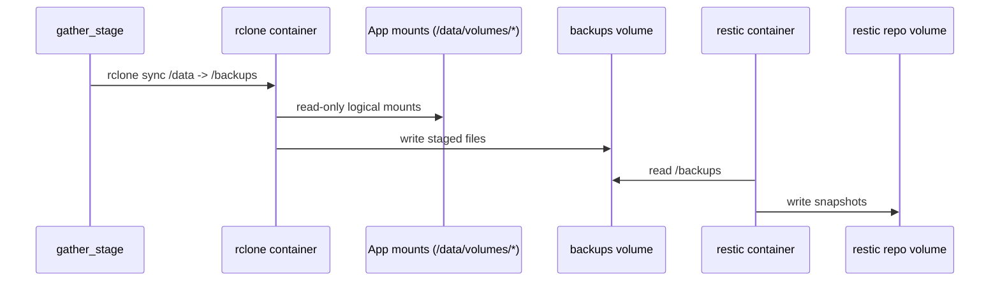
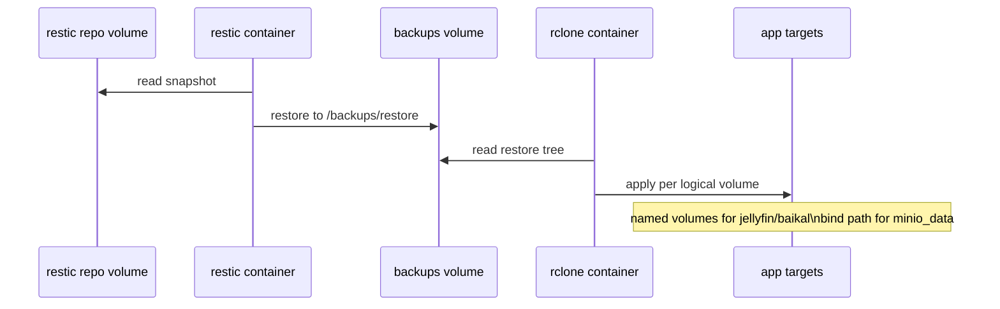
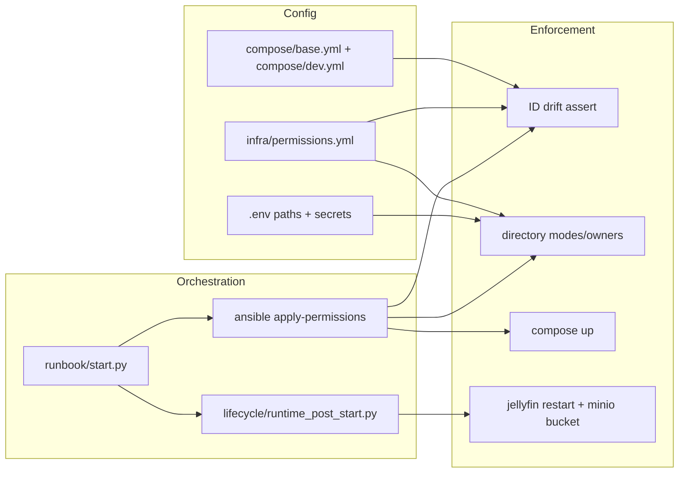

# Storage Topology

This document describes how named volumes and host binds are wired, and how backup/restore flows move data through them.

## 1. Runtime Mount Topology

## 2. Compose Alias Resolution

## 3. Backup Data Path (Gather + Restic)

## 4. Restore Data Path (Restic + Apply)

## 5. Ownership / Control Boundaries

